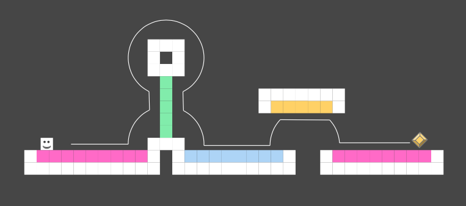

# Hues in the Air

## Concept

Hues in the Air is a Java reconstruction of the Nintendo game [Super One More
Jump](https://play.google.com/store/apps/details?id=com.smgstudio.sonemorejump&hl=en&gl=US&pli=1).
The premise for the multiplayer is that a colour (yellow, blue, green, pink) is assigned to each player
in the lobby. The players then have to work together to complete levels: each player can only control the
cube (by making it jump) when it is moving on a block of their own colour. This makes for a great cooperative
platformer which combines coordination, timing and prediction.

## Launching the game

The Main.java file is responsible for the launching of the game.
It can either be launched with the jar file generated 
by Gradle (*Tasks/other/build-cs108*) or from your favourite IDE.
The following arguments will be considered correct by 
the program, leading to a successful launch:

- `client`
- `client serverIP:serverPort`
- `client serverIP:serverPort username`
- `server serverPort`

These different options enable the autofill the fields in the login screen.

## Gameplay

The game is controlled by the players pressing the space bar.
When a player does so,
the cube jumps in a realistic and reproductible way.
The said cube is always moving forward,
so the player's task is to avoid obstacles by timing the jumps correctly.
Levels are chosen randomly from
three difficulty categories: easy, medium and hard.
The difficulty of the levels is determined by the
number of obstacles, the timing required to pass them and the number of "special elements" in the level.
The latter are elements that are not part of the level itself, but rather affect the gameplay in some way.
Players must therefore achieve rightly timed jumps while coordinating with their teammates and predicting
the directional changes of gravity (see [Gravity](#gravity)).

*Example level*

Important, but not obvious, is that the character can only move on coloured blocks: while
in Geometry Dash you die if you crash into a wall, gravity works a little differently in
Hues in the Air; death is thus brought about exclusively by contact with a white block.
If this is the case, the players have to start the level from scratch.
This causes them
to lose a life, which limits their chances of winning the game.

## Gravity

The gravity in the game has a constant magnitude, however, its direction changes as the
block moves.
As can be seen in the image above, jumping on a wall will cause the block to
keep moving, but the velocity component in the direction of the wall is set to 0.
This allows
for some interesting gameplay mechanics, such as the ability to jump around corners.

## Lives

When playing a game, the players start with only three lives.
With this set of chances to win,
they have to complete as many levels as possible.
They can lose a life by dying, but also win
one, two or three by completing a level (depending on the difficulty of the level).
Once the
players have lost all their lives, they are sent back to the lobby, where they can either start
a new game or go back to the menu to see how their score compares to the highscores.
The ten
highest scores (ever achieved) are saved in a file permanently and are updated every time a new
score is achieved.

## Easter Eggs

The game has a few Easter eggs/plain cheat codes. These are:

- the ability to skip a level by typing '!skip' in the chat
- the ability to have infinite lives by typing '!immortal' in the chat
- the ability to reset lives to their last value by typing '!mortal' in the chat

However, the use of these commands is considered as cheating and will result in the scores
of the players not being saved.